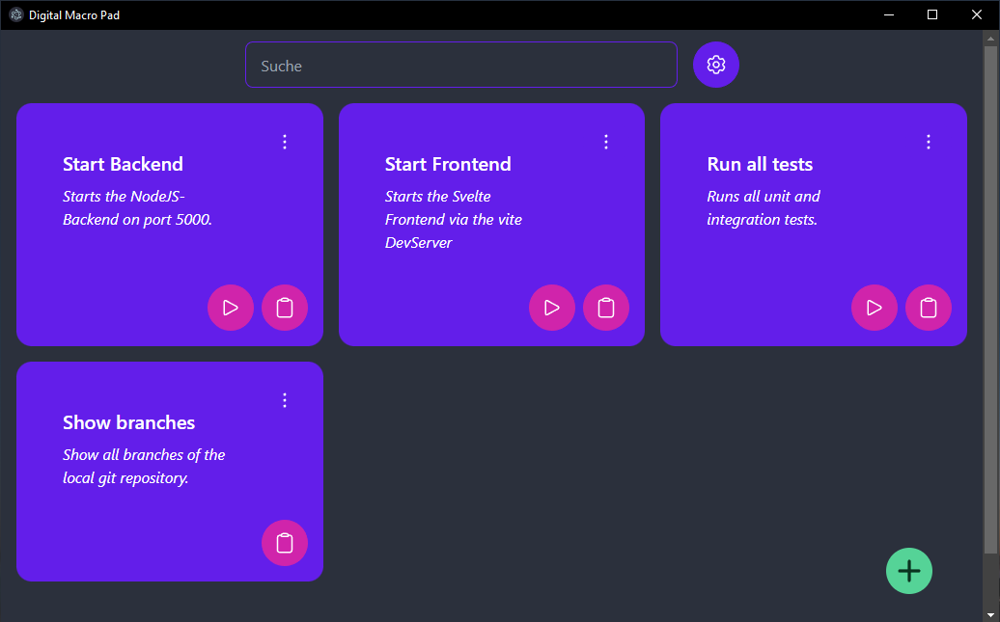

# Digital Macro Pad

A simple tool for creating and using digital macros.

## Features

* Creating, editing and deleting macros with a **name**, a **description** and a **command** to help you speed up your development process.
* Allows you to store often used macros and copy them when you need them.
* Macros will be automatically stored on your machine, so they are persistent even if you restart your PC.

## Installation guide

### Install via Release (Windows only)

1. Download the newest releas from the GitHub [Releases](https://github.com/powercode-boys/digital-macro-pad/releases) tab.
2. Extract the contents of the zip Archive.
3. Run the `digital-macro-pad-X.X.X Setup.exe`

### Install via Source (compile by yourself)

**This requires you to have NodeJS and NPM installed.**

1. Clone the repository via git (`git clone https://github.com/powercode-boys/digital-macro-pad.git`).
2. Navigate into the project folder (`cd digital-macro-pad`).
3. Install all NPM packages of this project (`npm install`).
4. Compile the project for your local operating system (`npm run build`)
5. Navigate into the `out/make/` folder. There will be folders for your local OS with the compiled binaries.

## Instructions on using the macro pad

* Click the "+" icon in the bottom right to add a new macro.
  * You can assign a name*, description and command to the macro (\* values are required).
* After a macro has been created click the clipboard icon to copy the command of a macro.
* Edit or delete a macro by accessing a dropdown menu by clicking on the three dots on any macro.

## Technologies that we are using

This project was created by combinig [Svelte](https://svelte.dev/) and [Electron](https://www.electronjs.org/) into a desktop application with reactive UI and file system integration.

For styling and layouting of the project we are using [daisyUI](https://daisyui.com/) on top of [TailwindCSS](https://tailwindcss.com/).